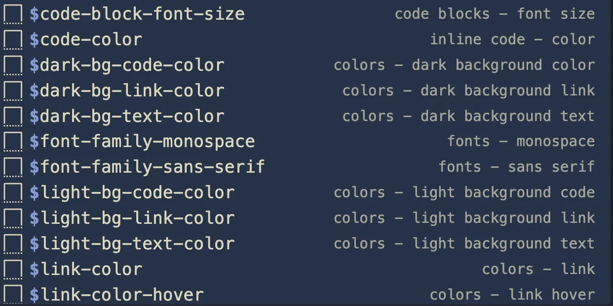

# 14  Miscellaneous

## 14.1 Hiding slides

changing the [slide visibility](https://quarto.org/docs/presentations/revealjs/advanced.html#slide-visibility) is as simple as setting `visibility="hidden"` attribute to the header of a slide

``` markdown
## Slide Title {visibility="hidden"}
```

I find this useful when I have to give the same presentation multiple times, and I have a disclaimer or other seasonally important slides. Instead of removing and reinserting the information each time, I just changed the attribute.

Slide deck demonstrating hidden slides: a slide marked with `visibility="hidden"` is skipped entirely during the presentation but remains in the source file.

[qmd](examples/miscellaneous/tip-3.qmd)

## 14.2 Avoid duplication using Includes

This last tip doesn’t come with an example, as it doesn’t get useful before you start working with multiple files. We are talking about the [includes](https://quarto.org/docs/authoring/includes.html) short code.

Using the following short code; `` includes the content of `_content.qmd` into the document in a “copy-paste” manner before the rendering of the document.

This has proved useful for me when I want the same slides to appear at the start or end of multiple decks. And you are not limited to .qmd files! you can embed html files or svg too.

## 14.3 VS Code & Positron code snippets

I find it hard to remember all the [Sass variables](https://quarto.org/docs/presentations/revealjs/themes.html#sass-variables) that are available.

I figured out we can get something working pretty well by using [code snippets](https://code.visualstudio.com/docs/editing/userdefinedsnippets) in VS Code or Positron. The following collapsed code chunk contains snippets for all the revealjs sass variables that are compatible. They should all trigger inside `.scss` files once you start with `$`. The snippets also default to contain the default value, which can help you figure out how you want to adjust it.



Since these are specific to presentations, I suggest that they are used as project-specific snippets. Add them in a `name.code-snippets` file inside `.vscode` folder at the base of your directory, and it should work right away.

All Sass Variables Code Snippets

``` json
{
  "colors - background": {
    "scope": "scss",
    "prefix": "$body-bg",
    "body": [
      "\\$body-bg: ${1:#fff};"
    ]
  },
  "colors - text": {
    "scope": "scss",
    "prefix": "$body-color",
    "body": [
      "\\$body-color: ${1:#222};"
    ]
  },
  "colors - muted text": {
    "scope": "scss",
    "prefix": "$text-muted",
    "body": [
      "\\$text-muted: ${1:lighten(\\$body-color, 50%)};"
    ]
  },
  "colors - link": {
    "scope": "scss",
    "prefix": "$link-color",
    "body": [
      "\\$link-color: ${1:#2a76dd};"
    ]
  },
  "colors - link hover": {
    "scope": "scss",
    "prefix": "$link-color-hover",
    "body": [
      "\\$link-color-hover: ${1:lighten(\\$link-color, 15%)};"
    ]
  },
  "colors - selection background": {
    "scope": "scss",
    "prefix": "$selection-bg",
    "body": [
      "\\$selection-bg: ${1:lighten(\\$link-color, 25%)};"
    ]
  },
  "colors - selection color": {
    "scope": "scss",
    "prefix": "$selection-color",
    "body": [
      "\\$selection-color: ${1:\\$body-bg};"
    ]
  },
  "colors - light background text": {
    "scope": "scss",
    "prefix": "$light-bg-text-color",
    "body": [
      "\\$light-bg-text-color: ${1:#222};"
    ]
  },
  "colors - light background link": {
    "scope": "scss",
    "prefix": "$light-bg-link-color",
    "body": [
      "\\$light-bg-link-color: ${1:#2a76dd};"
    ]
  },
  "colors - light background code": {
    "scope": "scss",
    "prefix": "$light-bg-code-color",
    "body": [
      "\\$light-bg-code-color: ${1:#4758ab};"
    ]
  },
  "colors - dark background text": {
    "scope": "scss",
    "prefix": "$dark-bg-text-color",
    "body": [
      "\\$dark-bg-text-color: ${1:#fff};"
    ]
  },
  "colors - dark background link": {
    "scope": "scss",
    "prefix": "$dark-bg-link-color",
    "body": [
      "\\$dark-bg-link-color: ${1:#42affa};"
    ]
  },
  "colors - dark background color": {
    "scope": "scss",
    "prefix": "$dark-bg-code-color",
    "body": [
      "\\$dark-bg-code-color: ${1:#ffa07a};"
    ]
  },
  "fonts - sans serif": {
    "scope": "scss",
    "prefix": "$font-family-sans-serif",
    "body": [
      "\\$font-family-sans-serif: ${1:'Source Sans Pro', Helvetica, sans-serif};"
    ]
  },
  "fonts - monospace ": {
    "scope": "scss",
    "prefix": "$font-family-monospace",
    "body": [
      "\\$font-family-monospace: ${1:monospace};"
    ]
  },
  "fonts - font size root": {
    "scope": "scss",
    "prefix": "$presentation-font-size-root",
    "body": [
      "\\$presentation-font-size-root: ${1:40px};"
    ]
  },
  "fonts - font smaller": {
    "scope": "scss",
    "prefix": "$presentation-font-smaller",
    "body": [
      "\\$presentation-font-smaller: ${1:0.7};"
    ]
  },
  "fonts - line height": {
    "scope": "scss",
    "prefix": "$presentation-line-height",
    "body": [
      "\\$presentation-line-height: ${1:1.3};"
    ]
  },
  "headings - h1 font size": {
    "scope": "scss",
    "prefix": "$presentation-h1-font-size",
    "body": [
      "\\$presentation-h1-font-size: ${1:2.5em};"
    ]
  },
  "headings - h2 font size": {
    "scope": "scss",
    "prefix": "$presentation-h2-font-size",
    "body": [
      "\\$presentation-h2-font-size: ${1:1.6em};"
    ]
  },
  "headings - h3 font size": {
    "scope": "scss",
    "prefix": "$presentation-h3-font-size",
    "body": [
      "\\$presentation-h3-font-size: ${1:1.3em};"
    ]
  },
  "headings - h4 font size": {
    "scope": "scss",
    "prefix": "$presentation-h4-font-size",
    "body": [
      "\\$presentation-h4-font-size: ${1:1em};"
    ]
  },
  "headings - font family": {
    "scope": "scss",
    "prefix": "$presentation-heading-font",
    "body": [
      "\\$presentation-heading-font: ${1:\\$font-family-sans-serif};"
    ]
  },
  "headings - color": {
    "scope": "scss",
    "prefix": "$presentation-heading-color",
    "body": [
      "\\$presentation-heading-color: ${1:\\$body-color};"
    ]
  },
  "headings - line height": {
    "scope": "scss",
    "prefix": "$presentation-heading-line-height",
    "body": [
      "\\$presentation-heading-line-height: ${1:1.2};"
    ]
  },
  "headings - letter spacing": {
    "scope": "scss",
    "prefix": "$presentation-heading-letter-spacing",
    "body": [
      "\\$presentation-heading-letter-spacing: ${1:normal};"
    ]
  },
  "headings - text transform": {
    "scope": "scss",
    "prefix": "$presentation-heading-text-transform",
    "body": [
      "\\$presentation-heading-text-transform: ${1:none};"
    ]
  },
  "headings - text shadow": {
    "scope": "scss",
    "prefix": "$presentation-heading-text-shadow",
    "body": [
      "\\$presentation-heading-text-shadow: ${1:none};"
    ]
  },
  "headings - font weight": {
    "scope": "scss",
    "prefix": "$presentation-heading-font-weight",
    "body": [
      "\\$presentation-heading-font-weight: ${1:600};"
    ]
  },
  "headings - h1 text shadow": {
    "scope": "scss",
    "prefix": "$presentation-h1-text-shadow",
    "body": [
      "\\$presentation-h1-text-shadow: ${1:none};"
    ]
  },
  "code blocks - background color": {
    "scope": "scss",
    "prefix": "$code-block-bg",
    "body": [
      "\\$code-block-bg: ${1:\\$body-bg};"
    ]
  },
  "code blocks - border color": {
    "scope": "scss",
    "prefix": "$code-block-border-color",
    "body": [
      "\\$code-block-border-color: ${1:lighten(\\$body-color, 60%)};"
    ]
  },
  "code blocks - font size": {
    "scope": "scss",
    "prefix": "$code-block-font-size",
    "body": [
      "\\$code-block-font-size: ${1:0.55em};"
    ]
  },
  "inline code - color": {
    "scope": "scss",
    "prefix": "$code-color",
    "body": [
      "\\$code-color: ${1:var(--quarto-hl-fu-color)};"
    ]
  },
  "inline code - background color": {
    "scope": "scss",
    "prefix": "$code-bg",
    "body": [
      "\\$code-bg: ${1:transparent};"
    ]
  },
  "tabset - border color": {
    "scope": "scss",
    "prefix": "$tabset-border-color",
    "body": [
      "\\$tabset-border-color: ${1:\\$code-block-border-color};"
    ]
  },
  "layout - border color": {
    "scope": "scss",
    "prefix": "$border-color",
    "body": [
      "\\$border-color: ${1:lighten(\\$body-color, 30%)};"
    ]
  },
  "layout - border width": {
    "scope": "scss",
    "prefix": "$border-width",
    "body": [
      "\\$border-width: ${1:1px};"
    ]
  },
  "layout - border radius": {
    "scope": "scss",
    "prefix": "$border-radius",
    "body": [
      "\\$border-radius: ${1:3px};"
    ]
  },
  "layout - block margin": {
    "scope": "scss",
    "prefix": "$presentation-block-margin",
    "body": [
      "\\$presentation-block-margin: ${1:12px};"
    ]
  },
  "layout - slide text align": {
    "scope": "scss",
    "prefix": "$presentation-slide-text-align",
    "body": [
      "\\$presentation-slide-text-align: ${1:left};"
    ]
  },
  "layout - title slide text align": {
    "scope": "scss",
    "prefix": "$presentation-title-slide-text-align",
    "body": [
      "\\$presentation-title-slide-text-align: ${1:center};"
    ]
  },
  "callouts - border width": {
    "scope": "scss",
    "prefix": "$callout-border-width",
    "body": [
      "\\$callout-border-width: ${1:0.3rem};"
    ]
  },
  "callouts - border scale": {
    "scope": "scss",
    "prefix": "$callout-border-scale",
    "body": [
      "\\$callout-border-scale: ${1:10%};"
    ]
  },
  "callouts - margin top": {
    "scope": "scss",
    "prefix": "$callout-margin-top",
    "body": [
      "\\$callout-margin-top: ${1:1rem};"
    ]
  },
  "callouts - margin bottom": {
    "scope": "scss",
    "prefix": "$callout-margin-bottom",
    "body": [
      "\\$callout-margin-bottom: ${1:1rem};"
    ]
  },
  "callouts - note color": {
    "scope": "scss",
    "prefix": "$callout-color-note",
    "body": [
      "\\$callout-color-note: ${1:#0d6efd};"
    ]
  },
  "callouts - tip color": {
    "scope": "scss",
    "prefix": "$callout-color-tip",
    "body": [
      "\\$callout-color-tip: ${1:#198754};"
    ]
  },
  "callouts - caution color": {
    "scope": "scss",
    "prefix": "$callout-color-caution",
    "body": [
      "\\$callout-color-caution: ${1:#fd7e14};"
    ]
  },
  "callouts - warning color": {
    "scope": "scss",
    "prefix": "$callout-color-warning",
    "body": [
      "\\$callout-color-warning: ${1:#ffc107};"
    ]
  },
  "callouts - important color": {
    "scope": "scss",
    "prefix": "$callout-color-important",
    "body": [
      "\\$callout-color-important: ${1:#dc3545};"
    ]
  }
}
```
