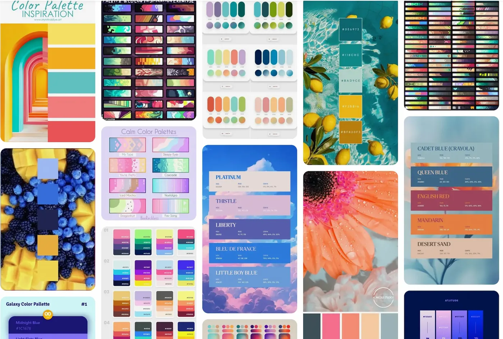
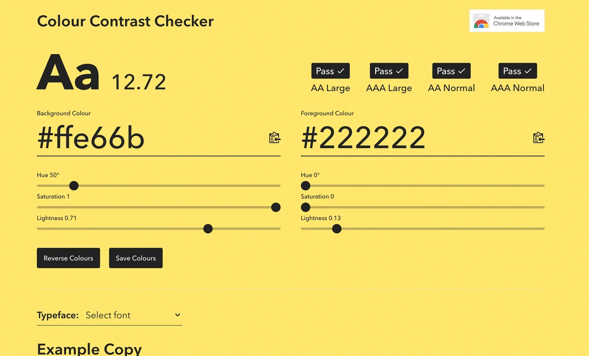

## Finding Colors

When finding your colors you will mainly look for 4 different types of colors:

- background colors
- text colors
- highlight colors
- theme colors

This is a simplistic model and it will do us just fine. In general, I think having 3-6 colors is about the right amount of colors. This doesn't mean that you couldn't have 10 colors in your theme, but that you should be very deliberate in your choices.

For a small color theme, you would want a light and dark color for the background and text color.
Dark text on a light background, or light text on dark background.
You could stop right here and use other visual elements for directing the viewers eyes such as italics, bolding of the text or using arrows.

If you want to use colors to draw the viewers eyes you can use colors, as long as that color isn't too close to the background and text colors.
Something that looks good with both your background and text color.
This color is a good opportunity to introduce your brand identity into your slides.
you generally want 1 to 3 of these colors.
Having at least 1 is perfectly sufficient and you can use it to great effect to direct the colors.
3 colors are where I'm still comfortable that they don't get diluted.
Using too many highlighting colors can confuse your viewers.
Having a 3 color slide theme can lead to a very effective and clear set of slides.

The important thing is that the background, highlight, and text colors are different enough from each others that they're legible.
This is explored more in the contrasts sections.
Theme colors on the other hand doesn't need to differentiable from the other colors,
as they only purpose is to visual appeal to the slides.
Having multiple shades of pink is perfectly acceptable as theme colors as long as they aren't too close to the background, text, or theme colors.
Likewise you could use rainbow colors to denote sections in the slides,
starting with red followed by yellow and green to denote a "problem", "solution", "results" phase.
These colors are simply there to spruce up the visuals.

This is what you get with the default themes that are provided in Quarto, and you can see them here in this gif:

<iframe class="slide-deck" src="examples/all-themes/index.html">

</iframe>

Which colors you choose will depend on what you are doing and who you are doing it for.
Some of you will have to follow the corporate mandated style guide,
and will thus have little to no input in the selections.
If you are free to decide for yourself I would suggest that you look around other peoples slides and themes,
to see what you like about them and what to take inspiration off.
Another personal favorite place of mine to go color theme hunting is on [pinterest](https://www.pinterest.com/).
I do a google search for "Pinterest color palettes" and go wild.

:::: {.content-visible when-format="html"}

:::

If you have any specific ideas in mind you can expand your search to include words like "sea", "beach", "Halloween", or "pastel".

## Contrasts

The main thing you need to keep in mind,
and the biggest difference from other types of colors you may have worked with,
such as in data visualization,
is that you need to have **high contrast** between your colors.
Namely your background, text, and highlight colors.
This is by far the most important thing that separates a good theme from a bad theme.
The goal for your slides is for other people to see them,
if your contrast is low then people can't.

There are many color contrast checking websites out there,
I like the [https://colourcontrast.cc/](https://colourcontrast.cc/) and [Color Contrast Checker by Coolors](https://coolors.co/contrast-checker/580b3a-f8f8f8).
If possible I try to have a contrast of at least 12,
but something like 10 will be okay from time to time.
Which is quite a high contrast without being impossible to hit.
Many browsers now have contrast checkers when you open developer mode.



This contrast requirement means that both your background and text color will be quite dark and light,
as it is quite hard for most highly saturated colors to have high contrasts to anything else.

::: {.callout-warning}
You should try to avoid pure black and pure white.
These colors can be a bit much and can be unpleasant to look at for long periods of time.
:::

This contrast is related to font size,
the smaller and finer the text is,
the more important it is that you have good contrast.

The contrast of the highlight colors should be different enough from the background and text color that they stand out.
If you are using multiple highlighting colors you should make sure that they are colorblind-friendly with each other.
I like to use the `check_color_blindness()` function from the [prismatic](https://emilhvitfeldt.github.io/prismatic/) package.


As we see above, the green and red colors don't work well together because they are almost identical for people with Deuteranopia.

::: {.callout-note}
These contrast calculations are a little harder to calculate when you are using images as they have uneven color.
Is it thus recommended to go with very light whites for dark image backgrounds and very dark blacks on light backgrounds.
It can also be helpful to include a small text background or outline to help it stand out from the background.
:::

## Applying Colors

Let us try all of that in practice.
I found this nice [blue and yellow](https://www.pinterest.com/pin/281123201723784541/) color palette on Pinterest.


using a color picking tool.
I love [ColorSlurp](https://colorslurp.com/) I can extract the colors to be

```r
*Orient*
02577B

*Fountain Blue*
5CB4C2

*Morning Glory*
99D9DD

*Mystic*
E1E8EB

*Selective Yellow*
F4BA02
```

I'm thinking I want to use dark blue as my background colors,
and the lightest color as my text color.
Before I do any modification I get the following


And by playing the sliders a little bit I have a contrast and some colors I'm happy with


We now open up our `.scss` file and fill in a couple of values.
Many of the colorings are done by relations,
so we can get a lot done by setting `$body-bg`, `$body-color`, and `$link-color`.
This needs to be done inside `scss:defaults`.

````scss
/*-- scss:defaults --*/
$body-bg: #01364C;
$body-color: #F7F8F9;
$link-color: #99D9DD;

/*-- scss:rules --*/

````

While the above configurations are perfectly fine,
I find that using [sass](https://quarto.org/docs/presentations/revealjs/themes.html#creating-themes) [variables](https://sass-lang.com/documentation/variables) to be clear,
and it helps us tremendously if we start making more changes.
So I create variables all with the prefix `theme-` and descriptive names so I know what is what.

````scss
/*-- scss:defaults --*/
$theme-darkblue: #01364C;
$theme-blue: #99D9DD;
$theme-white: #F7F8F9;
$theme-yellow: #F4BA02;

$body-bg: $theme-darkblue;
$body-color: $theme-white;
$link-color: $theme-blue;

/*-- scss:rules --*/

````

This is more code,
but now I can read at a glance what is happening.
This gives us the following colors on our slides.
All done with minimal effort.
Using one of the highlight colors here to color the links,
which also affects the hamburger menu and the progress bar at the bottom.

<iframe class="slide-deck" src="examples/colors/colors.html">

</iframe>

There are [several sass variables](https://quarto.org/docs/presentations/revealjs/themes.html#sass-variables) that are used to control how our slides look.
Notice how many of the values are defined as transformations of other values.
So by setting `$body-bg`, `$body-color`, and `$link-color` we automatically gets things like `$text-muted`, `$selection-bg`, `$border-color` with values that works pretty well.

Let us modify our theme just a bit more before moving on to fonts.
We can use [sass color functions](https://sass-lang.com/documentation/modules/color) to modify colors based on our theme.

I want the headers to pop a little bit more,
So I'm going to see if I can make them ever so slightly lighter blue.
I see that the sass variable that controls the header color is `$presentation-heading-color` and that it defaults to `$body-color`.
I use the `lighten()` function with `$theme-blue`,
iterating a couple of times to find the perfect value.

````scss
/*-- scss:defaults --*/
$theme-darkblue: #01364C;
$theme-blue: #99D9DD;
$theme-white: #F7F8F9;
$theme-yellow: #F4BA02;

$body-bg: $theme-darkblue;
$body-color: $theme-white;
$link-color: $theme-blue;
$presentation-heading-color: lighten($theme-yellow, 35%);

/*-- scss:rules --*/

````

<iframe class="slide-deck" src="examples/colors/colors-headers.html">

</iframe>

## Code Syntax Highlighter

The code syntax highlighting is handled through the [HTML Quarto handling](https://quarto.org/docs/output-formats/html-code.html#highlighting).
One can set the `highlight-style` yaml argument to specify which of the preset color schemes to use.
See the available options in the link above.

Since we are working with html format we can change the styling using CSS.
The highlighting is implemented using [skylighting](https://github.com/jgm/skylighting) which uses the following abbreviations for each type of code element.

- ot: Other
- at: Attribute
- ss: SpecialString
- an: Annotation
- fu: Function
- st: String
- cf: ControlFlow
- op: Operator
- er: Error
- bn: BaseN
- al: Alert
- va: Variable
- pp: Preprocessor
- in: Information
- vs: VerbatimString
- wa: Warning
- do: Documentation
- im: Import
- ch: Char
- dt: DataType
- fl: Float
- co: Comment
- cv: CommentVar
- cn: Constant
- sc: SpecialChar
- dv: DecVal
- kw: Keyword

the CSS we would use looks something like the code below.
This is a recreation of what the default highlighting theme is.

```scss
code {
  span.ot {
    color: #003B4F;
  }

  span.at {
    color: #657422;
  }

  span.ss {
    color: #20794D;
  }

  span.an {
    color: #5E5E5E;
  }

  span.fu {
    color: #4758AB;
  }

  span.st {
    color: #20794D;
  }

  span.cf {
    color: #003B4F;
  }

  span.op {
    color: #5E5E5E;
  }

  span.er {
    color: #AD0000;
  }

  span.bn {
    color: #AD0000;
  }

  span.al {
    color: #AD0000;
  }

  span.va {
    color: #111111;
  }

  span.pp {
    color: #AD0000;
  }

  span.in {
    color: #5E5E5E;
  }

  span.vs {
    color: #20794D;
  }

  span.wa {
    color: #5E5E5E;
  }

  span.do {
    color: #5E5E5E;
  }

  span.im {
    color: #00769E;
  }

  span.ch {
    color: #20794D;
  }

  span.dt {
    color: #AD0000;
  }

  span.fl {
    color: #AD0000;
  }

  span.co {
    color: #5E5E5E;
  }

  span.cv {
    color: #5E5E5E;
  }

  span.cn {
    color: #8f5902;
  }

  span.sc {
    color: #5E5E5E;
  }

  span.dv {
    color: #AD0000;
  }

  span.kw {
    color: #003B4F;
  }
}
```

This lets up change the style of each type of code individually.
Even so far as making the code italics, underlined, and animated.
you will have to conform to the same rules regarding color contrasts,
and changing the font sizes are not advised as it will mess with the alignment too much.

You might have noticed that the above code contain a lot of duplicates.
The below code chunk contained a compact version of the above expanded version.

```scss
code {
  span.an,
  span.op,
  span.sc,
  span.in,
  span.wa,
  span.do,
  span.cv,
  span.co {
    color: #5E5E5E;
  }

  span.er,
  span.bn,
  span.al,
  span.pp,
  span.dt,
  span.fl,
  span.dv {
    color: #AD0000;
  }

  span.ss,
  span.st,
  span.vs,
  span.ch {
    color: #20794D;
  }

  span.ot,
  span.cf,
  span.kw {
    color: #003B4F;
  }

  span.at {
    color: #657422;
  }

  span.fu {
    color: #4758AB;
  }

  span.va {
    color: #111111;
  }

  span.im {
    color: #00769E;
  }

  span.cn {
    color: #8f5902;
  }
}
```

<details>
<summary>Expanded with comments</summary>

```scss
code {
  // Other
  span.ot {
    color: #003B4F;
  }
  // Attribute
  span.at {
    color: #657422;
  }
  // SpecialString
  span.ss {
    color: #20794D;
  }
  // Annotation
  span.an {
    color: #5E5E5E;
  }
  // Function
  span.fu {
    color: #4758AB;
  }
  // String
  span.st {
    color: #20794D;
  }
  // ControlFlow
  span.cf {
    color: #003B4F;
  }
  // Operator
  span.op {
    color: #5E5E5E;
  }
  // Error
  span.er {
    color: #AD0000;
  }
  // BaseN
  span.bn {
    color: #AD0000;
  }
  // Alert
  span.al {
    color: #AD0000;
  }
  // Variable
  span.va {
    color: #111111;
  }
  // Preprocessor
  span.pp {
    color: #AD0000;
  }
  // Information
  span.in {
    color: #5E5E5E;
  }
  // VerbatimString
  span.vs {
    color: #20794D;
  }
  // Warning
  span.wa {
    color: #5E5E5E;
  }
  // Documentation
  span.do {
    color: #5E5E5E;
  }
  // Import
  span.im {
    color: #00769E;
  }
  // Char
  span.ch {
    color: #20794D;
  }
  // DataType
  span.dt {
    color: #AD0000;
  }
  // Float
  span.fl {
    color: #AD0000;
  }
  // Comment
  span.co {
    color: #5E5E5E;
  }
  // CommentVar
  span.cv {
    color: #5E5E5E;
  }
  // Constant
  span.cn {
    color: #8f5902;
  }
  // SpecialChar
  span.sc {
    color: #5E5E5E;
  }
  // DecVal
  span.dv {
    color: #AD0000;
  }
  // Keyword
  span.kw {
    color: #003B4F;
  }
}
```

</details>

<details>
<summary>Expanded with comments</summary>

```scss
code {
  span.an, // Attribute
  span.op, // Operator
  span.sc, // SpecialChar
  span.in, // Information
  span.wa, // Warning
  span.do, // Documentation
  span.cv, // CommentVar
  span.co {// Comment
    color: #5E5E5E;
  }

  span.er, // Error
  span.bn, // BaseN
  span.al, // Alert
  span.pp, // Preprocessor
  span.dt, // DataType
  span.fl, // Float
  span.dv {// DecVal
    color: #AD0000;
  }

  span.ss, // SpecialString
  span.st, // String
  span.vs, // VerbatimString
  span.ch {// Char
    color: #20794D;
  }

  span.ot, // Other
  span.cf, // ControlFlow
  span.kw {// Keyword
    color: #003B4F;
  }

  span.at {// Attribute
    color: #657422;
  }

  span.fu {// Function
    color: #4758AB;
  }

  span.va {// Variable
    color: #111111;
  }

  span.im {// Import
    color: #00769E;
  }

  span.cn {// Constant
    color: #8f5902;
  }
}
```

</details>

Below is some before and after using the theme we have developed in the chapter so far:

<iframe class="slide-deck" src="examples/colors/no-syntax-highlighting.html">

</iframe>

<a href="examples/colors/no-syntax-highlighting.qmd" target="_blank" class="listing-slides btn-links">qmd</a>
<a href="examples/colors/no-syntax-highlighting.scss" target="_blank" class="listing-video btn-links">scss</a>

<iframe class="slide-deck" src="examples/colors/syntax-highlighting.html">

</iframe>

<a href="examples/colors/syntax-highlighting.qmd" target="_blank" class="listing-slides btn-links">qmd</a>
<a href="examples/colors/syntax-highlighting.scss" target="_blank" class="listing-video btn-links">scss</a>