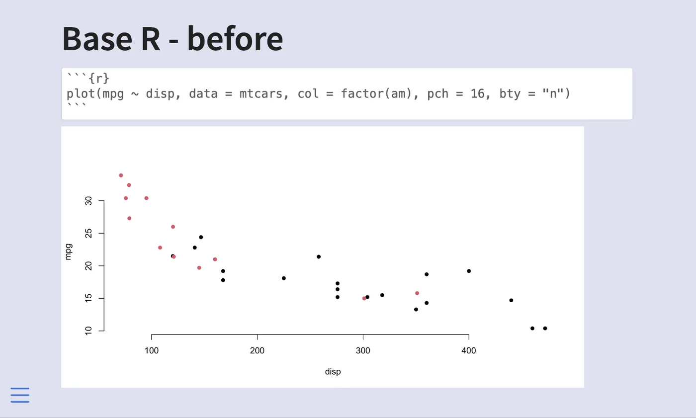
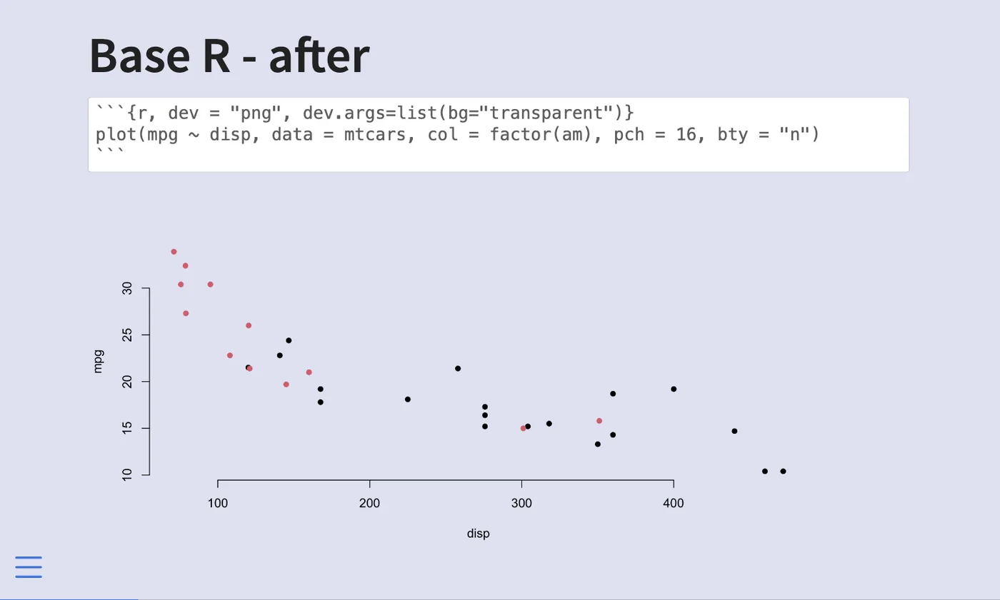
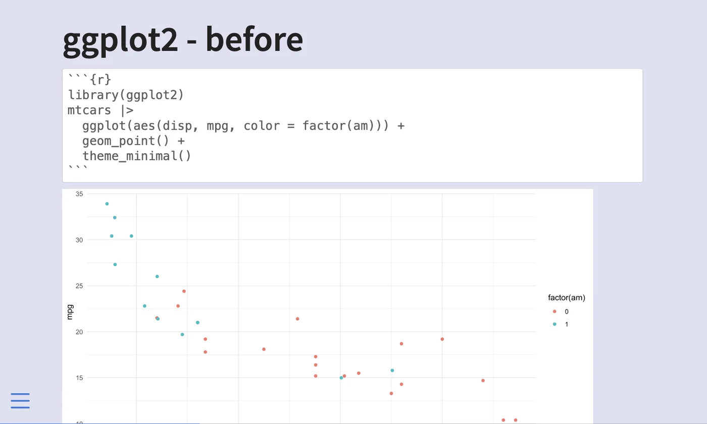
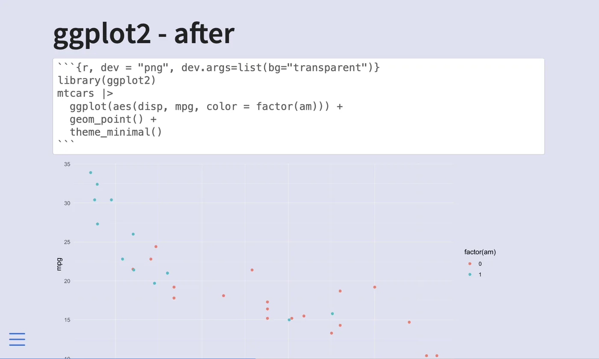
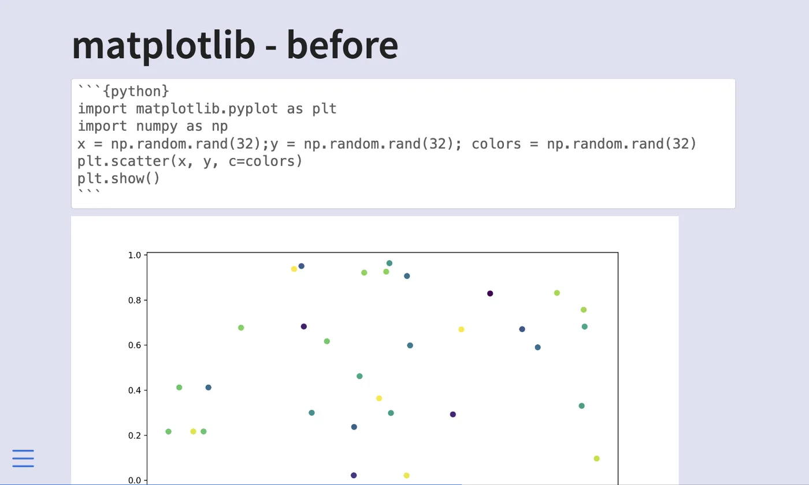
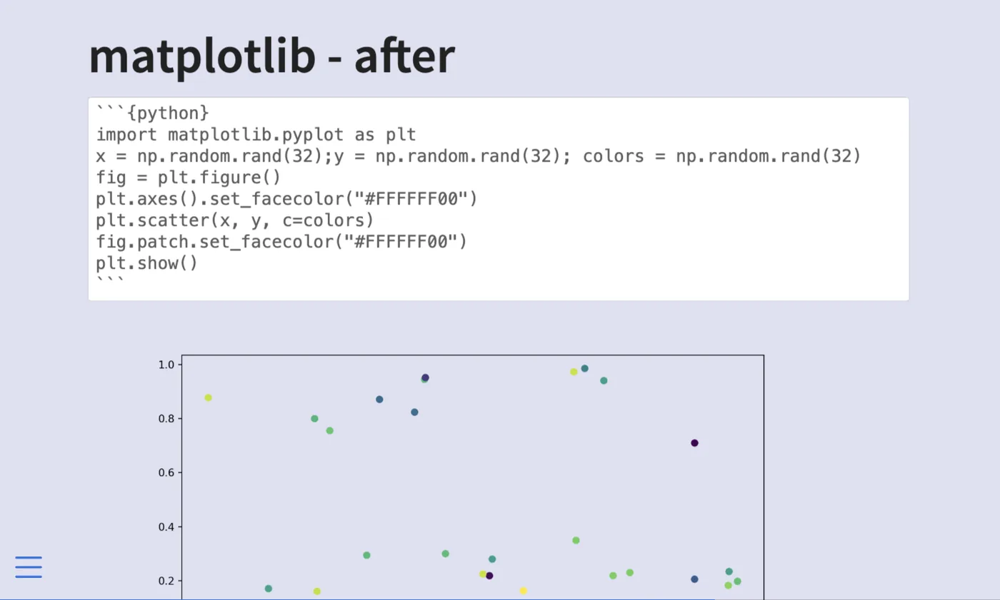
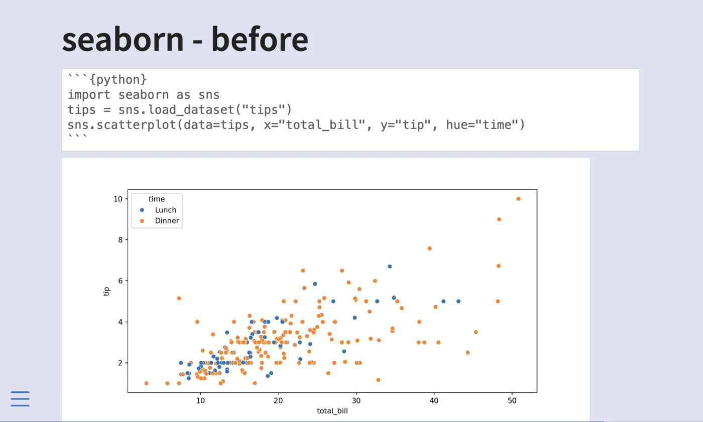
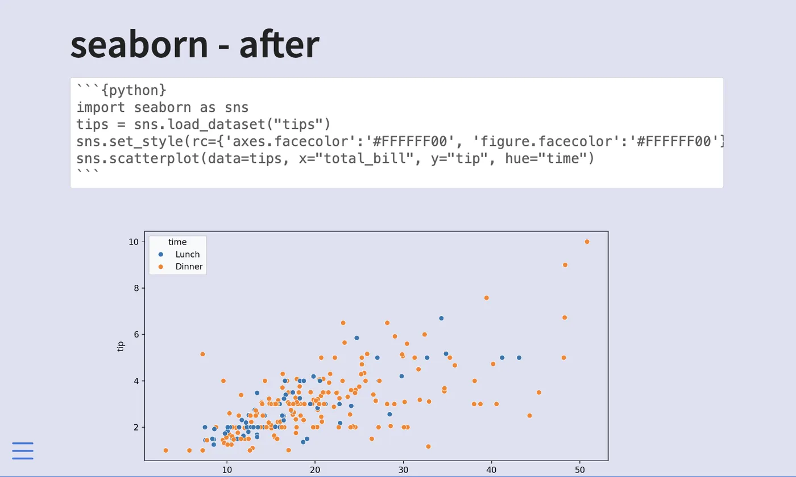

## Style menu button

The menu button you see in the lower left-hand side of the slide.
Styling it can be done by setting the `$link-color` sass variable.
If you want a different icon,
or have it colored differently than `$link-color` you need to specify it directly as the color [is hardcoded into the svg](https://github.com/quarto-dev/quarto-cli/blob/13c916d041b2f83c20855fd24c7bd68d07720981/src/resources/formats/revealjs/quarto.scss#L505).
The icon is specified as the background image of `.reveal .slide-menu-button .fa-bars::before`.

```scss
.reveal .slide-menu-button .fa-bars::before {
background-image: url('data:image/svg+xml,<svg xmlns="http://www.w3.org/2000/svg" width="16" height="16" fill="rgb(42, 118, 221)" class="bi bi-list" viewBox="0 0 16 16"><path fill-rule="evenodd" d="M2.5 12a.5.5 0 0 1 .5-.5h10a.5.5 0 0 1 0 1H3a.5.5 0 0 1-.5-.5zm0-4a.5.5 0 0 1 .5-.5h10a.5.5 0 0 1 0 1H3a.5.5 0 0 1-.5-.5zm0-4a.5.5 0 0 1 .5-.5h10a.5.5 0 0 1 0 1H3a.5.5 0 0 1-.5-.5z"/></svg>') !important;
}
```

The color is specified by the `fill="rgb(42, 118, 221)"` part of the svg.
But since this is an image, we can use whatever image we want.

```scss
.reveal .slide-menu-button .fa-bars::before {
background-image: url('https://cdn-icons-png.flaticon.com/512/2163/2163350.png') !important;
}
```

{
  .slide-deck
  loading="lazy"
  width="560"
  height="373"
  title="Custom hamburger menu icon via CSS background-image"
}

[qmd](examples/styling/tip-2.qmd){.listing-slides .btn-links target="_blank"}
[scss](examples/styling/tip-2.scss){.listing-video .btn-links target="_blank"}

## Showing quarto code

This one isn't as much a slidecrafting tip,
as it is a quarto tip!
If you are showing how to do something in Quarto using Quarto you need this tip.
In essence what we are working with are [unexcuted blocks](https://quarto.org/docs/computations/execution-options.html#unexecuted-blocks).

Adding a `markdown` cell around what you want to show.
Important to use more ticks than any of the inside cells inside.

Using double curly brackets to indicate that the code block should not be executed.
The following code when used in a quarto document will render as shown in the example

````` markdown
```` markdown
This is **Quarto** code

```{{{python}}}
1 + 1
```
````
`````

{
  .slide-deck
  loading="lazy"
  width="560"
  height="373"
  title="Displaying Quarto code as unexecuted source using double curly brackets"
}

[qmd](examples/elements/tip-6.qmd){.listing-slides .btn-links target="_blank"}

## Changing plot backgrounds

Plots and charts are useful in slides.
Changing the background makes them fit in.
This post will go over how to change the background of your plots to better match the slide background,
in a handful of different libraries.

### Why are we doing this?

If you are styling your slides to change the background color,
you will find that most plotting libraries default to using a white background color.
If your background is non-white it will stick out like a sore thumb.
I find that changing the background color to something transparent `#FFFFFF00` is the easiest course of action.

> Why make the background transparent instead of making it match the background?

It is simply easier that way.
There is only one color we need to set and it is `#FFFFFF00`.
This works even if the slide background color is different from slide to slide,
or if the background is a non-solid color.

### base R

we don't have to make any changes to the R code,
we can supply the chunk options `dev` and `dev.args` for the chunk to `"png"` and `list(bg="transparent")` respectively and you are good.
The chunk will look like this.

````md
```{{r, dev = "png", dev.args=list(bg="transparent")}}
plot(mpg ~ disp, data = mtcars, col = factor(am), pch = 16, bty = "n")
```
````

You can also change the options globally using the following options in the yaml.

```yaml
knitr:
  opts_chunk:
    dev: png
    dev.args: { bg: "transparent" }
```

::: {layout-ncol=2}



:::

### ggplot2

ggplot2 are handled the same way as base R plotting, so we don't have to make any changes to the R code, we can supply the chunk options `dev` and `dev.args` for the chunk to `"png"` and `list(bg="transparent")` respectively and you are good. The chunk will look like this.

````md
```{{r, dev = "png", dev.args=list(bg="transparent")}}
library(ggplot2)
mtcars |>
  ggplot(aes(disp, mpg, color = factor(am))) +
  geom_point() +
  theme_minimal()
```
````

You can also change the options globally using the following options in the yaml.

```yaml
knitr:
  opts_chunk:
    dev: png
    dev.args: { bg: "transparent" }
```

::: {layout-ncol=2}



:::

### matplotlib

With matplotlib, we need to set the background color twice,
once for the plotting area,
and once for the area outside the plotting area.

```python
fig = plt.figure()
# outside plotting area
plt.axes().set_facecolor("#FFFFFF00")

# your plot
plt.scatter(x, y, c=colors)

# inside plotting area
fig.patch.set_facecolor("#FFFFFF00")
```

::: {layout-ncol=2}



:::

### seaborn

For seaborn, we also set it twice, both of them in `set_style()`

```python
sns.set_style(rc={'axes.facecolor':'#FFFFFF00',
                  'figure.facecolor':'#FFFFFF00'})
```

::: {layout-ncol=2}



:::

### Source Document

The above was generated with this document.

[source document](examples/elements/plot-background-examples.qmd){.listing-slides .btn-links target="_blank"}

## Plot sizing

Plots and charts are useful in slides.
But we need to make sure they are sized correctly to be as effective as possible.

### auto-stretch option

Revealjs slides default to having the option [auto-stretch: true](https://quarto.org/docs/presentations/revealjs/advanced.html#stretch),
this ensures that figures always fit inside the slide. You can turn it off globally like this.

```yaml
format:
  revealjs:
    auto-stretch: false
```

or on a slide-by-slide basis by adding the `.nostretch` class to the slide.

```md
## Slide Title {.nostretch}
```

We see how they affect sizing in the following slides first with the default,
and second with `.nostretch`.

{
  .slide-deck
  loading="lazy"
  width="560"
  height="373"
  title="Plot with auto-stretch enabled (default)"
}

{
  .slide-deck
  loading="lazy"
  width="560"
  height="373"
  title="Plot with .nostretch class (natural size)"
}

By themselves, they look pretty similar.
One occasion where you really notice the difference is when there are other elements on the slide.
`auto-stretch` makes sure the image fits by making the image smaller as seen below.

{
  .slide-deck
  loading="lazy"
  width="560"
  height="373"
  title="Plot and title with auto-stretch enabled"
}

{
  .slide-deck
  loading="lazy"
  width="560"
  height="373"
  title="Plot and title with .nostretch class"
}

### Sizing Options

When sizing plots we need to remember that we have to deal with two kinds of sizes. First is the size of the actual file on disk,
this is controlled using `out-width` and `out-height`.
Next is how big the image is supposed to be in the document,
which is controlled using `fig-width`, `fig-height`, and/or `fig-asp`.
Lastly, you can control the location using `fig-align` and the resolution using `fig-dpi`.

All of these numbers will change depending on whether you have a title or other elements on your slides,
what fonts you use, and the aspect ratio of the slides themselves.

#### out-width, out-height

Setting these options affects the size of the resulting image on disk.
If they are set smaller than usual,
we get an image that doesn't take up the whole screen.

```{{r}}
#| out-width: 6in
#| out-height: 3.5in
```

{
  .slide-deck
  loading="lazy"
  width="560"
  height="373"
  title="Plot with out-width: 6in, out-height: 3.5in"
}

{
  .slide-deck
  loading="lazy"
  width="560"
  height="373"
  title="Comparison of small out-width/out-height with default-sized chart"
}


I don't find myself using these options much as I tend to want images that take up most of the space,
but they are useful to know.

### fig-width, fig-height

I end up using `fig-width` and `fig-height` the most out of the options shown in this blog post.
I find that the default values are too high,
making the text on the plot too small for the viewer to see.
Especially for an in-person audience.

Below is the same chart 4 times with different value pairs for `fig-width` and `fig-height`.
Notice how the default values appear to be around `fig-width: 9` and `fig-height: 5`.

{
  .slide-deck
  loading="lazy"
  width="560"
  height="373"
  title="Chart with fig-width: 9, fig-height: 5 (Reveal.js defaults)"
}

{
  .slide-deck
  loading="lazy"
  width="560"
  height="373"
  title="Chart with reduced fig-width and fig-height for better readability"
}

{
  .slide-deck
  loading="lazy"
  width="560"
  height="373"
  title="Another fig-width/fig-height comparison"
}

{
  .slide-deck
  loading="lazy"
  width="560"
  height="373"
  title="Fourth fig-width/fig-height variant showing larger, more legible chart text"
}


All of the above figures have roughly the same aspect ratios,
but if you want others you just specify different values.
Like this square chart below.

{
  .slide-deck
  loading="lazy"
  width="560"
  height="373"
  title="Square chart using equal fig-width and fig-height values"
}


### fig-asp

You might have noticed that the ratios shown in the last section weren't identical.
Because unless you deal with 1-2 or 1-1 ratios you are going to get decimals very fast.
And you have to recalculate small things over and over again.
This is why `fig-asp` is amazing.
Simply determine the aspect ratio between the height and width,
set that as the `fig-asp` and then you just have to set one of `fig-height` or `fig-width`.
Is it too small? increase `fig-height` and keep `fig-asp` the same.
is it too big? decrease `fig-height` and keep `fig-asp` the same.

{
  .slide-deck
  loading="lazy"
  width="560"
  height="373"
  title="Chart using fig-asp to fix aspect ratio for proportional scaling"
}

{
  .slide-deck
  loading="lazy"
  width="560"
  height="373"
  title="Same fig-asp at different fig-height showing proportional scaling"
}

### fig-align

Unless your chart fits fully inside the slide then it tends to be left aligned,
you can change that with `fig-align`,
setting it to `left`, `center` or `right`.

{
  .slide-deck
  loading="lazy"
  width="560"
  height="373"
  title="Chart with fig-align: left"
}

{
  .slide-deck
  loading="lazy"
  width="560"
  height="373"
  title="Chart with fig-align: center"
}

{
  .slide-deck
  loading="lazy"
  width="560"
  height="373"
  title="Chart with fig-align: right"
}


### fig-dpi

Lastly, something you might need to worry about is the **D**ots **P**er **I**nch (DPI) specified by `fig-dpi`.
This is a measure of resolution in your chart.
If you see your chart becoming a little blurry,
increase the dpi until it isn't anymore.
Note that dpi will result in larger file sizes,
so only change if you have to.

{
  .slide-deck
  loading="lazy"
  width="560"
  height="373"
  title="Chart at standard DPI"
}

{
  .slide-deck
  loading="lazy"
  width="560"
  height="373"
  title="Chart at higher fig-dpi for crisp text and lines"
}

### Make work with columns

even if you set the option globally,
you will have to make slide-by-slide adjustments,
such as with charts in `.columns`.
Below is one example of how we can modify the `fig-asp` to make it look decent in a column layout.

{
  .slide-deck
  loading="lazy"
  width="560"
  height="373"
  title="Chart inside two-column layout with fig-asp adjusted for column width"
}

### Source Document

The above was generated with this document.

[source document](examples/elements/plot-sizing-examples.qmd){.listing-slides .btn-links target="_blank"}
