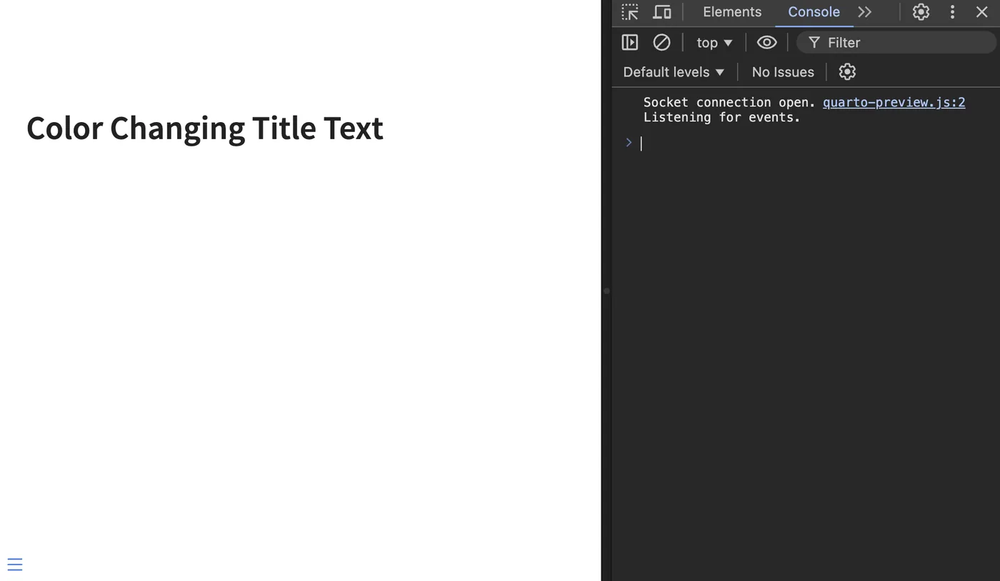

## Highlight incremental lists

The use of [incremental lists](https://quarto.org/docs/presentations/revealjs/#incremental-lists) is a great way to add a little something to a set of slides.
It also avoids a wall of text,
allowing the presenter to show one bullet at a time.
All in all, this is helpful as it can be used to focus the viewers' attention.

As a reminder, we create an incremental list using the following syntax:

```markdown
::: {.incremental}
- thing 1
- thing 2
:::
```

We can add another class to this div and use it to style it more.

```markdown
::: {.incremental .highlight-last}
- thing 1
- thing 2
:::
```

then we use this to style our list.
Below `.current-fragment` refers to the last shown item in the list.
Setting the `color: grey` isn't necessary,
but it is a way to downplay the "not-current" items

```scss
.highlight-last  {
  color: grey;
  .current-fragment {
    color: #5500ff;
  }
}
```

These together yield these slides:

{
  .slide-deck
  loading="lazy"
  width="560"
  height="373"
  title="Incremental list with .highlight-last CSS class"
}

{.listing-slides .btn-links target="_blank"}
{.listing-video .btn-links target="_blank"}

## Changing fragments with CSS

At the most fundamental level,
a fragment can be split into 3 stages

- before
- current
- after

determining which stage is handled completely by revealjs using the `fragment-index` attribute.
The way we can make things happen is to apply a different style to each of the 3 stages.

the maximal fragment signature is as follows,
with `fragment-name` being the name of the fragment in question.
For them to work properly you have to list them in the following order.
Which corresponds to `before`, `after`, and `current`.

```css
.reveal .slides section .fragment.fragment-name {
}

.reveal .slides section .fragment.fragment-name.visible {
}

.reveal .slides section .fragment.fragment-name.current-fragment {
}
```

::: {.callout-important}
The reason why this ordering is important is because `.visible` and `.current-fragment` are triggered at the same time.
And because I simplified the order a little too much. There isn't `before`, `current`, and `after`.
Instead, we have `always`, `current`, and `not-before-current`.
In essence, they do the same,
as long as you order them in this order to make sure they cascade properly.
:::

Before we try to implement a fragment by ourselves,
we need to note one thing real quick.
Each of these stages is styled a [specific way by default](https://github.com/quarto-dev/quarto-cli/blob/39dc173c4869ebaf4d6bb087a972acb87533b64e/src/resources/formats/revealjs/reveal/css/reveal.scss#L51-L65).
In practice, what this means is that the `before` style has the following attributes set to make the text invisible:

```css
opacity: 0;
visibility: hidden;
```

If you want the text to be visible before the fragment triggers,
simply set these two attributes to `unset`.

Another note I would like to add is that while you are able to modify anything in a fragment,
as it is just triggering CSS,
you should be careful about position and size.
While you might be able to make it work,
it is likely to cause a lot of shifting and jittering as elements resize.

::: {.callout-tip}
Looking at the [source code](https://github.com/quarto-dev/quarto-cli/blob/39dc173c4869ebaf4d6bb087a972acb87533b64e/src/resources/formats/revealjs/reveal/css/reveal.scss#L67-L207) for the default fragments gives us a good idea for how different styles of fragments work.
:::

## Example 1

This first example illustrates how the different phases work in a fragment.
We have thus created an `rgb` fragment that assigns a different color to each of the 3 phases.
We `unset` both `opacity` and `visibility` to have the text appear beforehand.
This leaves us with the following fragment:

```scss
.reveal .slides section .fragment.rgb {
  opacity: unset;
  visibility: unset;
  color: red;
}

.reveal .slides section .fragment.rgb.visible {
  color: blue;
}

.reveal .slides section .fragment.rgb.current-fragment {
  color: green;
}
```

Advancing and de-advancing(?) the slides showcase how the different classes are applied for fragments.

{
  .slide-deck
  loading="lazy"
  width="560"
  height="373"
  title="RGB fragment demo illustrating before, current, and after fragment phases"
}

{.listing-slides .btn-links target="_blank"}
{.listing-video .btn-links target="_blank"}

Worth noting that this single fragment could be rewritten as the following using SCSS nesting.

```scss
.reveal .slides section .fragment.rgb {
  opacity: unset;
  visibility: unset;
  color: red;

  &.visible {
    color: blue;
  }

  &.current-fragment {
    color: green;
  }
}
```

## Example 2

One custom fragment I use from time to time is the background highlighted style.
And it is very simple,
instead of changing the color of the text,
it changes the background color.
I find that it is a much stronger indication than changing the text itself.

This fragment gives us two things.
I leave the text visible beforehand.
Then it turns the background orange,
and after it lightens the background color a little bit.

```scss
$theme-orange: #FFB81A;

.reveal .slides section .fragment.hl-orange {
  opacity: unset;
  visibility: unset;

  &.visible {
    background-color: $theme-orange;
  }

  &.current-fragment {
    background-color: darken($theme-orange, 10%);
  }
}
```

This one is nice and flexible because it is easy to extend.

```scss
$theme-orange: #FFB81A;
$theme-yellow: #FFD571;
$theme-brown: #E2AE86;
$theme-pink: #FED7E1;

.reveal .slides section .fragment {

  &.hl-orange,
  &.hl-yellow,
  &.hl-pink,
  &.hl-brown {
    opacity: 1;
    visibility: inherit
  }

  &.hl-brown.visible {
    background-color: $theme-brown;
  }

  &.hl-brown.current-fragment {
    background-color: darken($theme-brown, 10%);
  }

  &.hl-orange.visible {
    background-color: $theme-orange;
  }

  &.hl-orange.current-fragment {
    background-color: darken($theme-orange, 10%);
  }

  &.hl-yellow.visible {
    background-color: $theme-yellow;
  }

  &.hl-yellow.current-fragment {
    background-color: darken($theme-yellow, 10%);
  }

  &.hl-pink.visible {
    background-color: $theme-pink;
  }

  &.hl-pink.current-fragment {
    background-color: darken($theme-pink, 10%);
  }
}
```

And we are willing to tap into some scss we can condense it down quite a lot using [SCSS loops](scss.qmd#using-each-to-automatically-create-classes).

```scss
$colors: (
  "orange": #FFB81A,
  "yellow": #FFD571,
  "brown": #E2AE86,
  "pink": #FED7E1
);

@each $name, $color in $colors {
  .reveal .slides section .fragment.hl-#{$name} {
    opacity: unset;
    visibility: unset;

    &.visible {
      background-color: lighten($color, 5%);
    }

    &.current-fragment {
      background-color: $color;
    }
  }
}
```

{
  .slide-deck
  loading="lazy"
  width="560"
  height="373"
  title="Background highlight fragment demo with custom .hl-* classes"
}

{.listing-slides .btn-links target="_blank"}
{.listing-video .btn-links target="_blank"}

## Example 3

The last example included a bit of flair by having the current fragment element be a slightly different color and then changing it after.
We can simplify it a bit by not specifying the `.current-fragment` class.

```scss
$theme-orange: #FFB81A;

.reveal .slides section .fragment.hl-orange {
  opacity: unset;
  visibility: unset;

  &.visible {
    background-color: $theme-orange;
  }
}
```

This fragment works more or less the same way as before but doesn't change color once it is applied.
It will be a more appropriate fragment many times.

This leads us to our final piece of knowledge in this blog post.
We don't have to fully specify a fragment.
We just have to declare how we want it to behave differently,
and then the default "stay hidden, then appear" fragment.

## Fragments 201

When a fragment is either shown or hidden `reveal.js` (the engine that powers our slides) will dispatch an event.
This event can be picked up using JavaScript.

You will need a little bit of Javascript knowledge,
but I found that you don't need a lot of knowledge to produce useful things for slides.
Once your slides are rendered in your browser, you can toggle the developer tools,
where you can find a javascript console. This is where I do the work needed.



We can capture the event using the following snippets of code

```js
Reveal.on('fragmentshown', (event) => {
  // event.fragment = the fragment DOM element
});
Reveal.on('fragmenthidden', (event) => {
  // event.fragment = the fragment DOM element
});
```

::: {.callout-important}
## Always implement both directions

Every JavaScript fragment **must** handle both `fragmentshown` (forward) and `fragmenthidden` (reverse).
Presenters routinely go backwards through slides.
A fragment that only implements `fragmentshown` will leave the slide in a broken state when navigated in reverse.

The canonical pattern is:

```js
Reveal.on('fragmentshown', (event) => {
  if (event.fragment.classList.contains("my-class")) {
    // apply the change
  }
});

Reveal.on('fragmenthidden', (event) => {
  if (event.fragment.classList.contains("my-class")) {
    // undo the change
  }
});
```

The `fragmenthidden` handler should be the exact inverse of `fragmentshown`: 
if you set a color, reset it; 
if you scroll down, scroll back up;
if you switch a tab, switch it back.
:::

`Reveal` is the javascript object that powers the whole presentation.
To have fun things happening when we use fragments, we need to write some code inside these curly brackets.
The first chunk of code runs whenever a fragment appears,
and the second runs whenever a fragment disappears.
In in this environment, we have access to the `event` which is the DOM element of fragment div itself as created in our slides.
We can take advantage of that in different ways as you will see.

```js
Event {
  "isTrusted": false,
  "fragment": "Node",
  "fragments": ["Node"],
  "type": "fragmentshown",
  "target": "Node",
  "currentTarget": "Node",
  "eventPhase": 2,
  "bubbles": true,
  "cancelable": true,
  "defaultPrevented": false,
  "composed": false,
  "timeStamp": 2259.5,
  "srcElement": "Node",
  "returnValue": true,
  "cancelBubble": false,
  "NONE": 0,
  "CAPTURING_PHASE": 1,
  "AT_TARGET": 2,
  "BUBBLING_PHASE": 3
}
```

Last note, you can have multiple of these `Reveal.on()` statements,
as they will trigger one after another.
So depending on how you want to organize,
both styles are valid.

```js
// one statement
Reveal.on('fragmentshown', (event) => {
  fragment_style_1(event);
  fragment_style_2(event);
  fragment_style_3(event);
});

// multiple statements
Reveal.on('fragmentshown', (event) => {
  fragment_style_1(event);
});
Reveal.on('fragmentshown', (event) => {
  fragment_style_2(event);
});
Reveal.on('fragmentshown', (event) => {
  fragment_style_3(event);
});
```

Lastly, the way I set up my revealjs slides to do javascript is by setting the `include-after-body` attribute in the yaml file,

```yaml
format:
  revealjs:
    include-after-body:
      - "_color.html"
```

and having it point to a file that looks like this:

```html
<script type="text/javascript">

</script>
```

then inside we put my javascript code,
which for this blog post will be some `Reveal.on()` calls.

## Color changing

This first example is going to be an illustrative example of what we can do and how to do it.
And it will thus not be very useful.

The first lesson I want to show is that you are not limited to modifying the content inside the fragment.
This means that we can actually have empty fragments that modify some other element.
So in our document,
we could have a slide that looks like this:

```markdown
## Color Changing Title Text

::: {.fragment .color}
:::
```

I want to change the color of the header when the fragment triggers.
To do that we need two things.

1. The color to change it into
2. Access to the header element

The first part is easy,
I found a "random javascript" script online.
We start by assigning that to a variable.

```js
random_color = '#'+(Math.random()*0xFFFFFF<<0).toString(16);
```

Next, we need to find the header.
Remember the `Reveal` object I mentioned earlier?
It has a very handy `.getCurrentSlide()` method.
When run we get the current slide we are on,
which is exactly what we need.

```js
Reveal.getCurrentSlide()
<section id=​"color-changing-title-text" class=​"slide level2 present" style=​"display:​ block;​" data-fragment=​"-1">
​  <h2>​Color Changing Title Text​</h2>
  ​<div class=​"fragment color" data-fragment-index=​"0">​</div>
​  <div class=​"quarto-auto-generated-content">​</div>​
</section>​
```

From this, we can get to the title using `.querySelector()`

::: {.callout-note}
We don't need `.querySelectorAll()` because by definition there will only be one `h2` on a quarto slide using default options.
:::

```js
Reveal
  .getCurrentSlide()
  .querySelector("h2")
<h2>Color Changing Title Text</h2>
```

We can then change the color by selecting the `style` element of the div and updating the `color` variable.

```js
Reveal
  .getCurrentSlide()
  .querySelector("h2")
  .style
  .color = random_color;
```

And that is technically all we need.
Put that code inside the `Reveal.on()` statements,
and the color of the header will change each time the fragment is triggered.

One thing worth remembering is that this javascript code will run everything a fragment is run.
So to limit it, we can make sure it only runs when we want it to.
This is why I gave the fragment a `.color` class.
We can use the following `if` statement to make sure our code only runs when we want it to.

```js
if (event.fragment.classList.contains("color")) {

}
```

We could stop here. But I want to show a little more with this example.
For right the color changes randomly,
but we could allow for a little bit of information transfer.
HTML has this concept called [datasets](https://developer.mozilla.org/en-US/docs/Web/API/HTMLElement/dataset).
Each div can have a data set of information.
We should use this to give our fragments more flexibility.

Luckily it is quite effortless to specify data set values in quarto.
Below is the same fragment div as before,
but with a data set value named `color`.

```markdown
::: {.fragment .color data-color="orange"}
:::
```

We can now on the javascript side pull out this value with ease.

```js
color = event.fragment.dataset.color;
```

::: {.callout-warning}
We are not doing any input checking,
so this code will fail silently if you don't have a color specified in the div.
:::

And set it the same as before.

```js
Reveal
  .getCurrentSlide()
  .querySelector("h2")
  .style
  .color = color;
```

This will give us the final fragment code as follows

```js
Reveal.on('fragmentshown', (event) => {
  if (event.fragment.classList.contains("color")) {
 random_color = '#'+(Math.random()*0xFFFFFF<<0).toString(16);
 
 Reveal
      .getCurrentSlide()
      .querySelector("h2")
      .style
      .color = random_color;
  }
});

Reveal.on('fragmenthidden', (event) => {
  if (event.fragment.classList.contains("color")) {
 color = event.fragment.dataset.color;

 Reveal
      .getCurrentSlide()
      .querySelector("h2")
      .style
      .color = color;
  }
});
```

{
  .slide-deck
  loading="lazy"
  width="560"
  height="373"
  title="Fragment that changes the slide heading color on each trigger"
}

{.listing-slides .btn-links target="_blank"}
{.listing-video .btn-links target="_blank"}

## Scroll output

Sometimes you run into a situation where you want to interact with an element on a slide.
This can happen when you need to scroll or toggle something.
While that would be fine to do by hand,
it can be hard to do casually,
and impossible to do if you are using a clicker.

Scrolling text in a window is one thing that isn't that hard to do with JavaScript.

We will follow the same steps as before.

1. Find the element we want to show
2. Figure out how to scroll it

The element can again be found using `.getCurrentSlide()` and `querySelector()` after a little digging.

```js
Reveal
  .getCurrentSlide()
  .querySelector(".cell-output code")
```

Next, we need to figure out how to scroll it.
This can be done using the [.scrollTo()](https://developer.mozilla.org/en-US/docs/Web/API/Window/scrollTo) method.
This function should be passed on to how much we want to scroll and how.
As far as I know, this can only be set using pixel values so we have to try a couple of times to get it right.
`1000` appears enough for this example to get us all the way to the bottom.
Setting `behavior` to smooth for a little flair.

```js
{
  top: 1000,
  behavior: "smooth",
}
```

This means that the fragment is finished with

```js
Reveal.on('fragmentshown', (event) => {
  if (event.fragment.classList.contains("scroll")) {
 Reveal
    .getCurrentSlide()
    .querySelector(".cell-output code")
    .scrollTo({
 top: 1000,
 behavior: "smooth",
    })
  }
});
```

But wait! What if you have to go back? this is where `fragmenthidden` is needed,
we simply take the preview code and say we want to go back to the top by setting `top` to `0`.

```js
Reveal.on('fragmenthidden', (event) => {
  if (event.fragment.classList.contains("scroll")) {
 Reveal
    .getCurrentSlide()
    .querySelector(".cell-output code")
    .scrollTo({
 top: 0,
 behavior: "smooth",
    })
  }
});
```

::: {.callout-note}
Some changes to our slides are really hard to reverse.
They would thus make for bad fragments.
You could implement them halfway without the `fragmenthidden` and you would just need to be really confident that you never have to go backwards in your slides.
:::

{
  .slide-deck
  loading="lazy"
  width="560"
  height="373"
  title="Fragment that smoothly scrolls a long code output block"
}

{.listing-slides .btn-links target="_blank"}
{.listing-video .btn-links target="_blank"}

::: {.callout-tip}
We didn't do it here,
but you could use dataset values to help determine which elements should be scrolled and how much to scroll them by instead of hardcoding it all as we do here.
:::

## Tabset advance

Quarto also has [tabset](https://quarto.org/docs/presentations/revealjs/index.html#tabsets) support for slides,
which is again a very nice feature.
It runs into the same clicker interaction we noted earlier.
It requires a mouse to correctly toggle in the middle of a presentation.

The [quarto-revealjs-tabset](https://github.com/mcanouil/quarto-revealjs-tabset) extension handles this for us.
It turns tabs into fragments so they can be advanced with arrow keys or a clicker.
See the [Tabset](#tabset) section below for installation and usage details.

::: {.callout-note collapse="true" title="Manual approach (for learning purposes)"}
Before the tabset extension existed, the only option was to write custom JavaScript.
This is a useful exercise for understanding how fragments work,
but for production use the extension is strongly recommended.

As always we need to find the elements and how to toggle them.

We are again using `.getCurrentSlide()` and `querySelector()`,
and with some trial and error,
determine that the following two [CSS selectors](https://www.w3schools.com/cssref/css_selectors.php) captures the two tabs.

- `.panel-tabset ul li:first-of-type a`
- `.panel-tabset ul li:last-of-type a`

And we are lucky because these elements have a working [`.click()`](https://developer.mozilla.org/en-US/docs/Web/API/HTMLElement/click) method that we can use.

This means that the full fragment looks like this:

```js
Reveal.on('fragmentshown', (event) => {
  if (event.fragment.classList.contains("tabswitch")) {
 Reveal
      .getCurrentSlide()
      .querySelector(".panel-tabset ul li:last-of-type a")
      .click()
  }
});

Reveal.on('fragmenthidden', (event) => {
  if (event.fragment.classList.contains("tabswitch")) {
 Reveal
      .getCurrentSlide()
      .querySelector(".panel-tabset ul li:first-of-type a")
      .click()
  }
});
```

{
  .slide-deck
  loading="lazy"
  width="560"
  height="373"
  title="Fragment that switches between two tabs in a tabset"
}

{.listing-slides .btn-links target="_blank"}
{.listing-video .btn-links target="_blank"}

The above only works with 2 tabs,
since we are toggling between the first and last one with `first-of-type` and `last-of-type`.

Let us now see how we can expand this to work with any number of tabs.
The toggling code now looks like this:

```js
const tabs = Reveal.getCurrentSlide().querySelectorAll(
  ".panel-tabset ul li a"
);

const currentIndex = [...tabs].findIndex(
  (node) => node.getAttribute("aria-selected") === "true"
);

tabs[currentIndex + 1]?.click();
```

We have a slightly different strategy now.
First we find all the tabs.
next we identify the index of current tab that we are on.
Lastly we select the next tab and `.click()` on it.
For the reverse we do `currentIndex - 1` instead.

{
  .slide-deck
  loading="lazy"
  width="560"
  height="373"
  title="Fragment switching any number of tabs using querySelectorAll"
}

{.listing-slides .btn-links target="_blank"}
{.listing-video .btn-links target="_blank"}

## advance embedded slides

The last example I'll show for now is one you have seen me use already.
I like to put quarto slides inside quarto slides.
However, it becomes messy to advance the embedded slides,
because they take focus of the mouse. I have used a fragment to advance these.

We start by embedding a set of slides in our set of slides.
We do thing with `<iframe class="slide-deck" loading="lazy" src="fragment-scroll.html" style="width:100%; height: 500px;" ></iframe>`.

The `Reveal` object has a [fairly extensive API](https://revealjs.com/api/) you can use.
So we just need to fetch the right `Reveal` object so we can use the `.left()` and `.right()` methods to advance the slides.
It took me a while to find the right code,
but [`.contentWindow`](https://developer.mozilla.org/en-US/docs/Web/API/HTMLIFrameElement/contentWindow) was the missing piece.
The following returns the embedded `Reveal` object.

```js
Reveal
  .getCurrentSlide()
  .querySelector("iframe")
  .contentWindow
  .Reveal
```

Which then gives us the following as our fragment

```js
Reveal.on('fragmentshown', event => {
  if (event.fragment.classList.contains("advance-slide")) {
 Reveal
      .getCurrentSlide()
       .querySelector("iframe")
      .contentWindow
      .Reveal
      .right()
    }
});
Reveal.on('fragmenthidden', event => {
  if (event.fragment.classList.contains("advance-slide")) {
 Reveal
      .getCurrentSlide()
      .querySelector("iframe")
      .contentWindow
      .Reveal
      .left()
    }
});
```

{
  .slide-deck
  loading="lazy"
  width="560"
  height="373"
  title="Demo of embedded slide advancement via contentWindow.Reveal.right()"
}

{.listing-slides .btn-links target="_blank"}
{.listing-video .btn-links target="_blank"}

## Fragment Extensions

The following extensions provide additional fragment capabilities beyond what we've covered so far.

### Roughnotation

The [quarto-roughnotation](https://github.com/EmilHvitfeldt/quarto-roughnotation) extension uses the [Rough Notation](https://roughnotation.com/) JavaScript library to add hand-drawn styled annotations to your slides.
These annotations can circle, underline, highlight, or strike-through text with an animated sketchy appearance.

{
  .slide-deck
  loading="lazy"
  width="560"
  height="373"
  title="Demo of the quarto-roughnotation extension"
}

To install:

```bash
quarto add EmilHvitfeldt/quarto-roughnotation
```

The extension provides several annotation types that can be triggered as fragments:

- `rn-underline` - Underline text
- `rn-circle` - Circle around text
- `rn-highlight` - Highlight text
- `rn-strike-through` - Strike through text
- `rn-crossed-off` - X through text
- `rn-bracket` - Bracket around text

Usage is simple:

```markdown
[This text will be circled]{.rn-circle .fragment}

[This will be highlighted]{.rn-highlight .fragment fragment-index=2}
```

You can customize colors and other properties using data attributes:

```markdown
[Important!]{.rn-underline data-rn-color="red" .fragment}
```

::: {.project-buttons}


:::

### More Fragments

The [quarto-revealjs-more-fragments](https://github.com/EmilHvitfeldt/quarto-revealjs-more-fragments) extension adds over 90 additional fragment animations to your presentations using the [Animate.css](https://animate.style/) and [Magic.css](https://www.minimamente.com/project/magic/) libraries.

{
  .slide-deck
  loading="lazy"
  width="560"
  height="373"
  title="Demo of the quarto-revealjs-more-fragments extension (90+ animations)"
}

To install:

```bash
quarto add EmilHvitfeldt/quarto-revealjs-more-fragments
```

Once installed, you can use any of the animation classes as fragments.
Some popular options include:

**Attention seekers:**

- `bounce`, `flash`, `pulse`, `shake`, `swing`, `wobble`

**Entrances:**

- `bounceIn`, `fadeIn`, `flipInX`, `rotateIn`, `zoomIn`, `slideInUp`

**Exits:**

- `bounceOut`, `fadeOut`, `flipOutX`, `rotateOut`, `zoomOut`

**Magic animations:**

- `magic`, `twisterInDown`, `swap`, `puffIn`, `vanishIn`

Usage:

```markdown
[This will bounce in]{.fragment .bounceIn}

[This will fade in from the left]{.fragment .fadeInLeft}
```

::: {.project-buttons}


:::

### Tabset {#tabset}

The [quarto-revealjs-tabset](https://github.com/mcanouil/quarto-revealjs-tabset) extension turns tabs into fragments,
so they can be navigated with arrow keys or a clicker instead of requiring mouse clicks.

{
  .slide-deck
  loading="lazy"
  width="560"
  height="373"
  title="Demo of the quarto-revealjs-tabset extension"
}

To install:

```bash
quarto add mcanouil/quarto-revealjs-tabset@1.3.0
```

Once installed, add the plugin to your YAML header:

```yaml
---
title: "My Presentation"
format:
  revealjs: default
revealjs-plugins:
  - tabset
---
```

Then use standard Quarto tabset syntax.
No special classes or fragment divs are needed:

````markdown
## Slide with Tabset

::: {.panel-tabset}

### Tab 1

Content for the first tab.

### Tab 2

Content for the second tab.

### Tab 3

Content for the third tab.

:::
````

The plugin automatically detects `.panel-tabset` divs and treats each tab as a fragment.
It supports multiple tabsets per slide, nested fragments within tabs, and bidirectional navigation.

When exporting to PDF, each tab automatically appears on its own page without needing `pdf-separate-fragments: true` globally.

::: {.project-buttons}


:::
