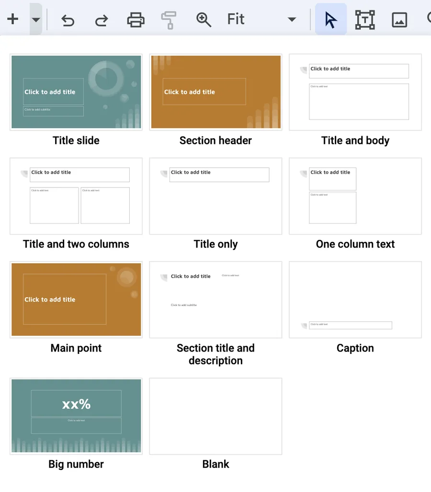

The built in themes are a great place to look for inspiration.

{
  .slide-deck
  loading="lazy"
  width="560"
  height="373"
  title="Interactive demo of all 11 built-in Quarto Reveal.js themes"
}

This is also a perfect place to start looking for inspiration.
Using these themes with one or two modifications might get you all the way where you want to go.
It is in general a good idea to look for inspiration in other people's work.

This chapter covers what I like to call **theme variants** and **slide theme**.

## What is a variant?

When we are slidecrafting and you start having many slides.
It can be helpful to bucket them into fewer types of slides.
This way you can reuse the same style many times with minimal copy-pasting.

Using colors to create multiple variants of the same theme allows us to quickly add similar looking,
yet different styles.
The `inverse` theme variant of [xaringan](https://github.com/yihui/xaringan) was a dark grey background slide,
that accompanied the white background themed default.
I and many other people found this `inverse` theme helpful for creating a break in slides.
Typically using it as a section break or a background on which to show a quote.

You can also imagine having a couple of more similar theme variants
that are used to denote theory/practice, idea/execution, pros/cons.
The opportunities are endless,
and we are not limited to only 2.
I have in the past used themes that slowly changes colors as the slides progressed through the topics.

Variants are useful in a lot of different ways:

- section slides: gives a break in the slides
- functional use: (exercise slides, demo slides, results slides)
- have different sections of the slides (introduction, problem, solution red/yellow/green) purely aesthetic

## The SCSS basics

Fortunately, adding this behavior in [quarto revealjs](https://quarto.org/docs/presentations/revealjs/) slides. We need 2 things:

1. Mark slides that have each theme variant
2. include css/scss to style each theme

In our `.qmd` document we can denote each slide as a class with the following syntax

```md
## Slide

## Slide {.variant-one}

## Slide {.variant-two}
```

this gives the slides the corresponding `css` class which we can create styles for.
Notice how the first slide doesn't have a variant specified.
Depending on your usage,
it is easier to have a good base style,
and only use `{.class}` to specify when you want a different class.

create a `.scss` file and add it to the themes in the yaml section

```md
format:
  revealjs:
    theme: [default, styles.scss]
```

And in the `.scss` file, we add the boilerplate information.

```scss
/*-- scss:defaults --*/

/*-- scss:rules --*/
```

Under the `/*-- scss:rules --*/` section we can now specify all the css rules we want.
And we do this by prefixing `.variant ` to each style.
As an example,
if we want to change the color of the text we use `.variant-one {color: blue;}`,
or the link color `.variant-one a {color: green;}`.

You can quite quickly end up making many changes.
And this is where I find it helpful to use [scss nesting](https://sass-lang.com/documentation/style-rules#nesting).
Nesting allows us to rewrite

```css
.variant-one {
  color: #d6d6d6;
}

.variant-one h1, h2, h3 {
  color: #f3f3f3;
}

.variant-one a {
  color: #00e0e0;
}

.variant-one p code {
  color: #ffd700;
}
```

as

```scss
.variant-one {
  color: #d6d6d6;
  h1, h2, h3 {
    color: #f3f3f3;
  }

  a {
    color: #00e0e0;
  }

  p code {
    color: #ffd700;
  }
}
```

I find it quite readable and I encourage you to follow the link and read more about it!
Using this syntax,
having multiple different variants is quite effortless,
and many IDEs will help highlight and collapse this type of syntax.

```scss
.variant-one {
  color: #d6d6d6;
  h1, h2, h3 {
    color: #f3f3f3;
  }

  a {
    color: #00e0e0;
  }

  p code {
    color: #ffd700;
  }
}

.variant-two {
  color: #a6a6d6;
  h1, h2, h3 {
    color: #222222;
  }

  a {
    color: #f22341;
  }

  p code {
    color: #ff00ff;
  }
}
```

And that is all that is needed!
I have taken the liberty to create two themes to show case how this is done in practice:

<https://github.com/EmilHvitfeldt/quarto-revealjs-inverse>

{
  .slide-deck
  loading="lazy"
  width="560"
  height="373"
  title="Demo of the quarto-revealjs-inverse theme"
}

<https://github.com/EmilHvitfeldt/quarto-revealjs-seasons>

{
  .slide-deck
  loading="lazy"
  width="560"
  height="373"
  title="Demo of the quarto-revealjs-seasons theme"
}

## What is a slide theme?

The inspiration for this style of slidecraft isn't anything new.
If you have used conventional slide-making tools you have seen a dropdown menu before



With these menus,
you can swiftly select the style of slide you intend to write and fill in the content.
I find that for some presentations that I all I need.

Below is one such theme I created

{
  .slide-deck
  loading="lazy"
  width="560"
  height="373"
  title="Demo of the quarto-revealjs-earth slide theme"
}

::: {.project-buttons}

[ Github](https://github.com/EmilHvitfeldt/quarto-revealjs-earth)
[ Website](https://emilhvitfeldt.github.io/quarto-revealjs-earth/)

:::

Instead of carefully managing the style of all the elements of each slide.
They all have an overall slide theme that controls all the content on the slide.
This controls colors and sizes but can go further and control backgrounds and even the positioning of elements.

Take `.theme-section1` as an example.
Not only are the text and colors modified.
The text region is being modified such that the text isn't going to overlap with the globe on the right.
Setting this up beforehand is quite nice.
While the backgrounds might seem complicated,
they are all SVGs,
but you can use any other type of image or none at all.

Once you have created the theme,
your slides will look like this:

```md
## Happy slides {.theme-title1 .center}

## Fancy Section {.theme-section3 .center}

### Less Fancy Subtitle

## Funny title {.theme-slide1}

Content

## Exciting title {.theme-slide2}

Content

## Sad title {.theme-slide3}

Content
```

Each slide will have minimal CSS,
just one or two classes specified on the slide level.

## How to create your own

What we will be doing is creating several [CSS classes](scss.qmd#using-css-classes).
I find it easier to prefix all of them with `.theme-` but that is not a requirement.
We will also be using the feature that [Sass lets us create nesting rules css](https://sass-lang.com/documentation/style-rules/#nesting).

We start with a simple class rule

```scss
.theme-slide1 {
}
```

if we are following my advice on [creating css color palettes](https://www.emilhvitfeldt.com/post/slidecraft-colors-fonts/#applying-colors) then we can use those to specify header colors

```scss
.theme-slide1 {
  h3 {
    color: $theme-blue; // or #5CB4C2
  }
}
```

And we can specify anything want in here.
Note that anything inside `h3` applies to all `h3` headers in `.theme-slide1` slides.

```scss
.theme-slide1 {
  h3 {
    color: $theme-blue; // or #5CB4C2
    font-size: 2em;
  }
}
```

We could specify specific background colors

```scss
.theme-slide1 {
  background-color: #E1E8EB
  h3 {
    color: $theme-blue; // or #5CB4C2
    font-size: 2em;
  }
}
```

Or we could specify background images,
for reasons I don't want to get into,
this is the way to include an image nicely.
With `../../../../../assets/slide1.svg` being a valid path to the slides.
You may have to modify the number of `../` for this to work

```scss
.theme-slide1 {
  &:is(.slide-background) {
    background-image: url('../../../../../assets/slide1.svg');
    background-size: cover;
    background-position: center;
    background-repeat: no-repeat;
  }
  h3 {
    color: $theme-blue; // or #5CB4C2
    font-size: 2em;
  }
}
```

depending on your slides you might have repeated styles a lot.
Sass has a way to help us with [`@mixin` and `@include`](https://sass-lang.com/documentation/at-rules/mixin/).
You can create a `@mixin` with several styles, and then instead of copying around all the styles,
you can `@include` the mixin for the same effect.
Using this we now have the following

```scss
@mixin background-full {
  background-size: cover;
  background-position: center;
  background-repeat: no-repeat;
}

.theme-slide1 {
  &:is(.slide-background) {
    background-image: url('../../../../../assets/slide1.svg');
    @include background-full;
  }
  h3 {
    color: $theme-blue; // or #5CB4C2
    font-size: 2em;
  }
}
```

Lastly, if you are using images the way I'm using them,
you will need to change the text regions to avoid text overlapping with the background image,
we can use the `margin-` rules for that

```scss
@mixin background-full {
  background-size: cover;
  background-position: center;
  background-repeat: no-repeat;
}

.theme-slide1 {
  &:is(.slide-background) {
    background-image: url('../../../../../assets/slide1.svg');
    @include background-full;
  }
  h3 {
    color: $theme-blue; // or #5CB4C2
    font-size: 2em;
  }
  h2, h3, h4, h5, p, pre {
    margin-left: 100px;
  }
}
```

I hope you can see that with this style of slidecrafting,
the skies the limit.
The style sheet for the above example can be [found here](https://github.com/EmilHvitfeldt/quarto-revealjs-earth/blob/main/_extensions/earth/earth.scss).

## More Examples

Below is another theme,
following very closely the construction of the previous

{
  .slide-deck
  loading="lazy"
  width="560"
  height="373"
  title="Demo of the quarto-revealjs-cinco-de-mayo slide theme"
}

::: {.project-buttons}

[ Github](https://github.com/EmilHvitfeldt/quarto-revealjs-cinco-de-mayo)
[ Website](https://emilhvitfeldt.github.io/quarto-revealjs-cinco-de-mayo/)
[ Scss file](https://github.com/EmilHvitfeldt/quarto-revealjs-cinco-de-mayo/blob/main/_extensions/cinco-de-mayo/cinco.scss)

:::

Another approach to creating these styles of themes is to use Lua to further expand the capabilities of the slides

{
  .slide-deck
  loading="lazy"
  width="560"
  height="373"
  title="Demo of a PositConf 2023 slide theme using a Lua extension"
}

::: {.project-buttons}

[ Github](https://github.com/kmasiello/positconfslides)
[ Website](https://katie.quarto.pub/positconf2023/)
[ Lua file](https://github.com/kmasiello/positconfslides/blob/main/_extensions/positconfslides/positconfslides.lua)

:::
